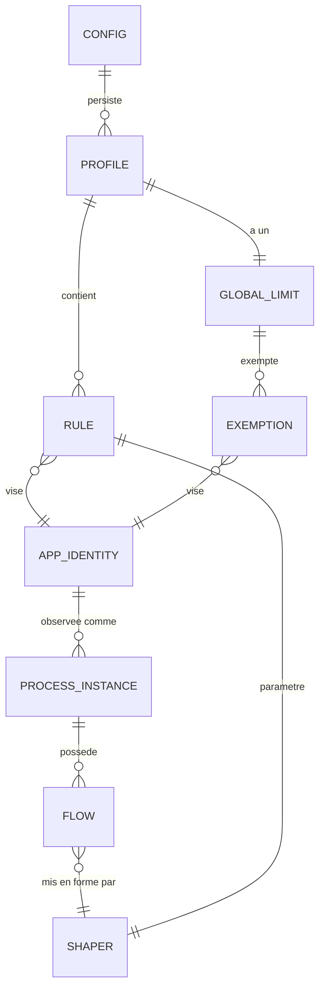

# Phase 1 — Modèle de données

**Feature**: `001-bandwidth-limiter` | **Date**: 2026-09-18 | **Plan**: [plan.md](./plan.md)

Entités, invariants et transitions d'état. Les invariants marqués **[TEST]** sont des tests
unitaires obligatoires : ce sont eux qui rendent le principe III exécutable plutôt que déclaratif.

---

## Vue d'ensemble



Distinction structurante : **ce qui est persisté** (`Config`, `Profile`, `Rule`, `GlobalLimit`,
`AppIdentity`) et **ce qui est volatil** (`ProcessInstance`, `Flow`, `Shaper`, `RateSample`,
`HealthState`). Rien de volatil n'est écrit sur disque — FR-018 et le principe VI l'imposent :
un historique de flux persisté deviendrait un journal des habitudes de navigation.

---

## Entités persistées

### `Config`

Racine du fichier de configuration.

| Champ | Type | Contrainte |
|-------|------|------------|
| `schemaVersion` | entier | = 1 en v1. Version inconnue → traitée comme corrompue |
| `activeProfileId` | GUID | MUST référencer un profil existant |
| `profiles` | liste de `Profile` | 1 à 5 éléments |

**Invariants**

- **[TEST]** `activeProfileId` référence toujours un profil présent dans `profiles`. À la
  lecture, une référence orpheline bascule sur le premier profil et lève un avertissement de
  santé — jamais un démarrage sans profil actif.
- **[TEST]** Au moins un profil existe en permanence. Supprimer le dernier profil est refusé.
- **[TEST]** L'écriture est atomique : après une interruption simulée en cours d'écriture, le
  fichier relu est soit l'ancien contenu intégral, soit le nouveau, jamais un mélange.

---

### `Profile`

| Champ | Type | Contrainte |
|-------|------|------------|
| `id` | GUID | Immuable après création |
| `name` | chaîne | 1 à 64 caractères, unique, sans caractère de contrôle |
| `rules` | liste de `Rule` | 0 à 200 éléments |
| `globalLimit` | `GlobalLimit` | Toujours présent, éventuellement désactivé |

**Invariants**

- **[TEST]** Les noms de profils sont uniques, comparaison insensible à la casse.
- **[TEST]** Un seul profil est actif à la fois (FR-021).
- **[TEST]** Changer de profil retire d'abord toutes les règles de l'ancien, puis applique
  celles du nouveau. Aucun état intermédiaire où les deux jeux coexistent.

---

### `Rule`

| Champ | Type | Contrainte |
|-------|------|------------|
| `id` | GUID | Immuable |
| `target` | `AppIdentity` | Voir ci-dessous |
| `downloadLimitBytesPerSecond` | entier long, nullable | `null` = illimité |
| `uploadLimitBytesPerSecond` | entier long, nullable | `null` = illimité |
| `enabled` | booléen | FR-006 : désactiver sans supprimer |
| `exemptFromGlobal` | booléen | FR-011 |

**Invariants**

- **[TEST]** Tout plafond non nul est compris entre **10 240** et **1 073 741 824** octets/s
  (10 Ko/s à 1 Go/s). Hors bornes → rejet **avant** écriture, côté service comme côté interface
  (FR-007).
- **[TEST]** Une règle dont les deux plafonds sont `null` est valide mais sans effet ; elle est
  affichée comme telle, pas silencieusement supprimée.
- **[TEST]** Deux règles actives ne peuvent viser la même `AppIdentity` dans un même profil.
- **[TEST]** `exemptFromGlobal` et un plafond propre coexistent : l'application est alors limitée
  par sa règle seule, sans contrainte du plafond global.

---

### `GlobalLimit`

| Champ | Type | Contrainte |
|-------|------|------------|
| `enabled` | booléen | FR-012 |
| `downloadLimitBytesPerSecond` | entier long, nullable | Mêmes bornes que `Rule` |
| `uploadLimitBytesPerSecond` | entier long, nullable | Mêmes bornes que `Rule` |

**Invariants**

- **[TEST]** Quand il est actif, le plafond effectif d'une application non exemptée est
  `min(plafond de la règle, plafond global)` par sens, `null` étant traité comme l'infini
  (FR-010).
- **[TEST]** Désactiver le plafond global laisse les règles par application intactes (FR-012).

---

### `AppIdentity`

Identité stable d'une application. Conception justifiée en
[R-007](./research.md#r-007--identité-dune-application-fr-039).

| Champ | Type | Contrainte |
|-------|------|------------|
| `executablePath` | chaîne | Chemin complet **normalisé**. Critère primaire |
| `executableName` | chaîne | Nom de fichier seul. Critère de **repli** |
| `displayName` | chaîne | Affichage. Non utilisé pour la correspondance |

**Normalisation** (fonction pure, dans `Core/Classification`) : résolution
`\Device\HarddiskVolumeN\...` → lettre de lecteur, résolution des liens symboliques et jonctions,
casse repliée en invariant, séparateurs unifiés.

**Invariants**

- **[TEST]** La normalisation est idempotente : `normalize(normalize(p)) == normalize(p)`.
- **[TEST]** Deux écritures du même chemin réel produisent la même `AppIdentity`.
- **[TEST]** Un processus dont le chemin correspond exactement est apparié en mode **exact**.
- **[TEST]** Si aucun processus ne correspond au chemin, un processus dont seul
  `executableName` correspond est apparié en mode **repli**, et l'appariement est marqué comme
  tel pour l'affichage (FR-039a).
- **[TEST]** Un appariement par repli ne devient jamais silencieux : le mode d'appariement est
  toujours remonté à l'interface (FR-039c).

---

## Entités volatiles

### `ProcessInstance`

| Champ | Type | Rôle |
|-------|------|------|
| `processId` | entier | PID Windows |
| `startTime` | horodatage | **Garde anti-réutilisation de PID** |
| `executablePath` | chaîne | Normalisé, résolu une fois puis mis en cache |
| `isPackaged` | booléen | Application Microsoft Store (FR-038) |

**Invariants**

- **[TEST]** La clé de cache est le couple `(processId, startTime)`. Un PID réutilisé par un
  autre processus produit une clé différente et force une nouvelle résolution. Sans cette garde,
  le trafic d'une application serait attribué à une autre — donc limité à sa place.
- **[TEST]** Un chemin non résoluble (processus protégé, terminé entre-temps) donne une instance
  marquée « inconnue » dont le trafic n'est **jamais** limité.

---

### `Flow`

Une connexion, alimentée par la couche FLOW de WinDivert.

| Champ | Type |
|-------|------|
| `endpointId` | entier long — identifiant WinDivert |
| `protocol` | TCP / UDP |
| `localAddress`, `localPort` | quintuplet |
| `remoteAddress`, `remotePort` | quintuplet |
| `processId` | entier |
| `scope` | `Internet` / `Local` / `Loopback` |

**Invariants**

- **[TEST]** `scope` est calculé par une fonction pure sur l'adresse distante, selon les plages
  de [R-006](./research.md#r-006--distinction-internet--réseau-local-fr-040). Jeu de tests
  exhaustif sur les bornes de chaque plage, IPv4 et IPv6.
- **[TEST]** Seul `scope == Internet` est soumis aux plafonds (FR-040).
- **[TEST]** Un paquet dont le flux est absent de la table est réinjecté **immédiatement et sans
  limitation**, jamais retenu ni rejeté (principe IV).
- **[TEST]** `FLOW_DELETED` retire l'entrée. Un balayage périodique purge les entrées sans
  événement de suppression, bornant la table.

---

### `Shaper`

Seau à jetons. Cœur testable du produit, sans aucune dépendance à Windows.

| Champ | Type | Rôle |
|-------|------|------|
| `rateBytesPerSecond` | entier long | Débit cible |
| `capacityBytes` | entier long | `max(2 × MTU, débit × 100 ms)` |
| `availableTokens` | double | État courant |
| `lastRefill` | horodatage | Fourni par `ISystemClock` |
| `parent` | `Shaper`, nullable | Seau global |

**Invariants**

- **[TEST]** `availableTokens` reste dans `[0, capacityBytes]` en toutes circonstances.
- **[TEST]** Sur une durée T à débit cible R, le volume autorisé est dans les 10 % de `R × T`,
  pour T ≥ 10 s. Vérifié par simulation à horloge virtuelle, sans attente réelle.
- **[TEST]** Un paquet n'est émis que si le seau **et** son parent ont assez de jetons ; les deux
  sont débités ensemble, jamais l'un sans l'autre.
- **[TEST]** Changer `rateBytesPerSecond` à chaud ne remet pas `availableTokens` à zéro et ne le
  laisse pas dépasser la nouvelle capacité.
- **[TEST]** Une horloge qui recule (ajustement d'heure, veille) ne crée pas de jetons et ne
  bloque pas le seau.
- **[TEST]** Aucun `Thread.Sleep` ni horloge réelle dans ces tests.

**File de retard associée** : bornée par règle. Pleine → **rejet en queue**, compté et exposé
dans l'état de santé et dans `MetricsTick.droppedPackets`. C'est le seul endroit du produit où un
paquet est volontairement perdu, et il est mesuré.

- **[TEST]** FR-003c : pour un flux temporisable — tout le montant, et le descendant à contrôle
  de congestion — le compteur de rejets reste à **zéro** quel que soit le plafond. Un rejet
  survenant là où la temporisation suffisait signifie que le produit dégrade le trafic alors
  qu'il pouvait le ralentir.
- **[TEST]** FR-003a : pour un flux descendant sans contrôle de congestion, le plafond est tenu
  à 20 % près et le compteur de rejets est strictement positif — c'est le mécanisme même de la
  limite, il doit être visible plutôt que subi.

---

### `RateSample` et agrégation

| Champ | Type |
|-------|------|
| `appIdentity` | référence |
| `downloadBytesPerSecond`, `uploadBytesPerSecond` | entier long |
| `timestamp` | horodatage |

**Invariants**

- **[TEST]** Fenêtre glissante de 60 s au pas de 1 s (FR-017), mémoire bornée quel que soit le
  temps écoulé.
- **[TEST]** Les échantillons ne sont **jamais** persistés (FR-018).
- **[TEST]** Aucune adresse distante ni nom d'hôte n'entre dans cette structure.

---

### `HealthState`

| Champ | Type |
|-------|------|
| `interceptionActive` | booléen |
| `driverLoaded` | booléen |
| `activeRuleCount` | entier |
| `inactiveRules` | liste de (règle, raison) |
| `queuePressure` | ratio 0–1 |
| `vpnDetected` | booléen |
| `suspended` | booléen |
| `configWarning` | chaîne, nullable |

**Raisons d'inactivité** énumérées et exhaustives : `ApplicationNotRunning`,
`ExecutablePathNotFound`, `MatchedByFallbackName`, `RuleDisabled`, `GloballySuspended`,
`InterceptionUnavailable`, `PackagedAppUnsupported`.

**Invariant**

- **[TEST]** Toute règle non appliquée porte exactement une raison. Une règle inactive sans
  raison est un bug : c'est précisément la question « pourquoi cette application n'est pas
  limitée ? » à laquelle le principe VI oblige à répondre.

---

## Transitions d'état

### Service

```text
Stopped ──démarrage──> CheckingCompatibility
                            │
        version/archi non supportée ──> Refused (aucune limite, message explicite)
                            │ OK
                            v
                    LoadingConfig ──corrompue──> Degraded (aucune limite, avertissement)
                            │ OK
                            v
                    OpeningHandles ──échec──> Degraded (aucune limite, cause affichée)
                            │ OK
                            v
                        Shaping <──reprise── Suspended
                            │  │                  ^
                            │  └───suspension─────┘
            pression excessive / arrêt / crash
                            v
                      FailOpen (handles fermés, trafic libre)
```

**Invariants**

- **[TEST]** Tout chemin quittant `Shaping` ferme les handles **avant** toute autre action.
- **[TEST]** `Refused`, `Degraded` et `FailOpen` n'appliquent aucune limite. Vérifié par un test
  qui mesure un débit non contraint dans chacun de ces états.
- **[TEST]** Un arrêt brutal du processus (`TerminateProcess`) aboutit à un trafic non limité
  (SC-009).

### Règle

```text
Defined ──application présente + interception active──> Active
   ^                                                      │
   └──── application terminée / suspension / désactivation ┘
```

Une règle `Defined` mais non `Active` porte toujours une raison exploitable par l'interface.

---

## Correspondance exigences → invariants

| Exigence | Où elle est tenue |
|----------|-------------------|
| FR-001, FR-007 | Bornes de `Rule`, validées service **et** interface |
| FR-003 | Invariants de `Shaper` + banc de mesure (R-012) |
| FR-005 | `AppIdentity` → plusieurs `ProcessInstance`, comptées et affichées |
| FR-010 | Hiérarchie de `Shaper`, `min` par sens |
| FR-018 | `RateSample` volatil, sans adresse |
| FR-022 | Invariants de `Config` + traitement de la corruption |
| FR-025 | Transitions vers `FailOpen` |
| FR-026 | `HealthState.inactiveRules`, raison obligatoire |
| FR-034 | ACL du fichier de configuration — le verrou réel, pas l'interface |
| FR-039, FR-039a-c | Appariement exact puis repli, mode toujours remonté |
| FR-040, FR-040a-b | `Flow.scope`, fonction pure testée aux bornes |
